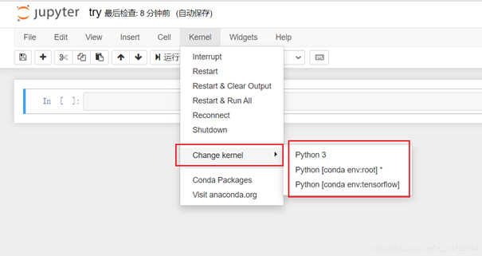

- 从cmd启动jupyter
```shell
!conda install jupyter notebook
!jupyter notebook
```
- Jupyter Notebook使用指定的conda环境
 ```
 !conda install nb_conda
 ```
 

 ### vscode有用的插件
 - paste image 
可以在markdown文本中快速插入图片并保存到指定cache位置